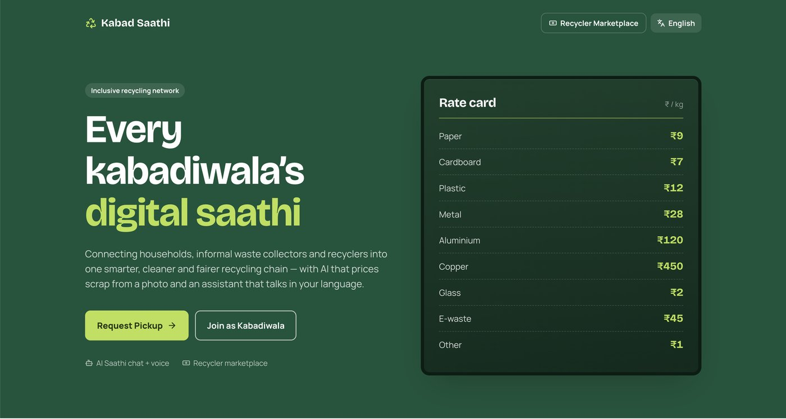
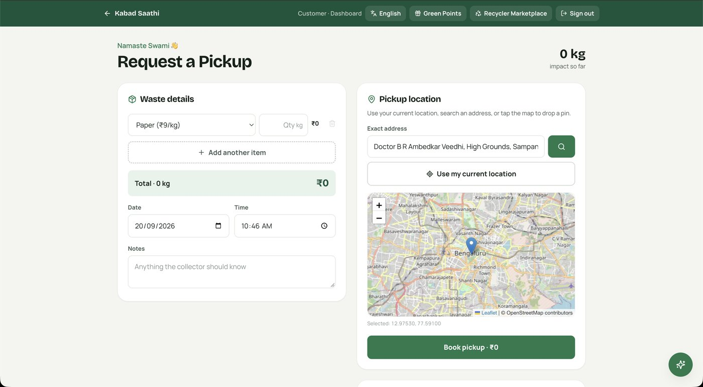
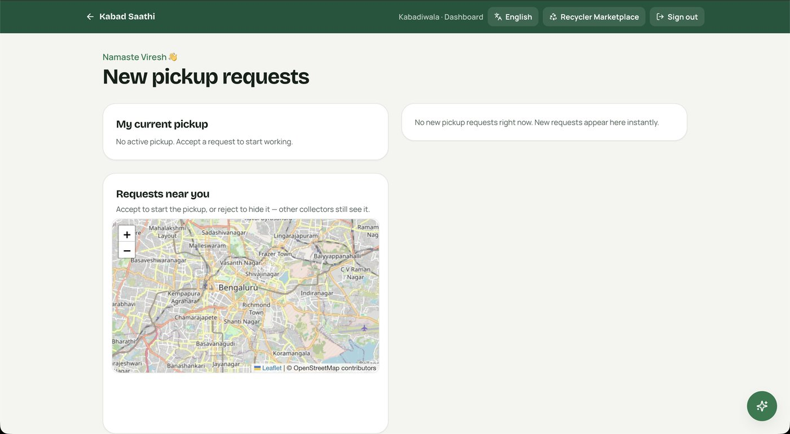

<div align="center">

# Kabad Saathi ♻️

### Every kabadiwala's digital saathi

A doorstep scrap-pickup platform connecting **households**, **informal waste collectors (kabadiwalas)** and **formal recyclers** into one fairer recycling chain.

[**Live Demo**](https://kabad-sathi.vercel.app) · [Report a Bug](https://github.com/Swamiviresh/Kabad-Sathi/issues)


</div>



---

## Problem Statement

Kabadiwalas quietly keep a large part of India's recyclable waste out of landfills, yet the system around them is fragmented:

- **Households** have no easy way to sell scrap, no transparent rates, and little reason to separate low-value materials like glass.
- **Kabadiwalas** depend on walking routes and word of mouth, sell through layers of middlemen, and have no digital record of their work. Most apps are also not built for a cheap phone, one hand and a language other than English.
- **Formal recyclers** want sorted, traceable material in bulk but have no easy way to reach the collectors who gather it.

**The question:** how do we give households convenience and fair prices, give collectors demand and better buyers, and give recyclers traceable supply, without asking anyone to learn a complicated app?

## About the Project

**Kabad Saathi** ("scrap companion") is a hackathon MVP built to answer that question. A household lists their scrap, sees a fixed ₹/kg rate up front and requests a pickup. Nearby kabadiwalas see the request and one accepts it. After collection, both sides confirm, the collector's earnings are recorded, and the household earns Green Points. Collectors can then sell sorted scrap directly to formal buyers through the built-in Recycler Marketplace.

It is designed to be **simple** (big buttons, one decision per screen), **multilingual** (English, हिन्दी, ಕನ್ನಡ) and **fair** (published rates, direct access to recyclers). It also runs with **zero setup** in a local demo mode.

| Customer dashboard | Collector dashboard |
| :---: | :---: |
|  |  |

## Features

- **Multi-item pickup requests** with a fixed ₹/kg rate card and an automatic total
- **Location picker** with current location, address search or map pin (Leaflet + OpenStreetMap)
- **Collector queue:** accept or reject requests (reject only hides it for you)
- **Live pickup tracking:** Pending → Accepted → On the way → Collected → Completed
- **Contact sharing** (name and tap-to-call phone), only after a collector accepts
- **Collector earnings dashboard** with monthly pickups, scrap weight, earnings, rating and best category
- **AI Saathi assistant:** typed and voice chat that can check status, cancel pickups, look up prices, read earnings and pre-fill bookings, with an offline keyword fallback
- **Recycler Marketplace** (`/recycle`): Recykal, Attero, Banyan Nation, Saahas Zero Waste and ITC WOW, filterable by category
- **Green Points:** points per kg (weighted towards hard-to-recycle materials), levels from Sapling to Forest, and redeemable rewards
- **Three languages** that drive the UI, voice input and AI replies
- **Two storage modes:** local JSON file or Supabase

### Rate Card (₹ / kg)

| Paper | Cardboard | Plastic | Metal | Aluminium | Copper | Glass | E-waste | Other |
| :---: | :---: | :---: | :---: | :---: | :---: | :---: | :---: | :---: |
| 9 | 7 | 12 | 28 | 120 | 450 | 2 | 45 | 1 |

## Tech Stack

| Layer | Technology |
| --- | --- |
| Framework | Next.js 16, React 18, TypeScript |
| Styling | Tailwind CSS, Lucide icons |
| Maps | Leaflet, react-leaflet, OpenStreetMap |
| Database | Local JSON (`data/db.json`) or Supabase |
| AI Assistant | LLM with tool-use via OpenRouter |
| Voice | Browser Web Speech API |
| SMS / OTP (optional) | Twilio |
| Hosting | Vercel |

## Getting Started

**Prerequisites:** Node.js 20+ and npm. Supabase, OpenRouter and Twilio are all optional.

```bash
git clone https://github.com/Swamiviresh/Kabad-Sathi.git
cd Kabad-Sathi
npm install
cp .env.example .env.local
npm run dev
```

Open **http://localhost:3000**.

### Environment Variables (all optional)

| Variable | Purpose | If empty |
| --- | --- | --- |
| `OPENROUTER_API_KEY` / `OPENROUTER_MODEL` | Powers the AI Saathi assistant | Keyword-based fallback |
| `NEXT_PUBLIC_SUPABASE_URL` / `NEXT_PUBLIC_SUPABASE_ANON_KEY` | Supabase connection | Local JSON database |
| `TWILIO_ACCOUNT_SID` / `TWILIO_AUTH_TOKEN` / `TWILIO_FROM_NUMBER` | Real SMS OTPs | OTP shown on screen |
| `OTP_HASH_SECRET` | Secret for hashing OTPs | **Change before deploying** |

To use Supabase, run [`supabase.sql`](./supabase.sql) in the Supabase SQL Editor, then add the URL and anon key to `.env.local`.

## How to Use

**Demo mode:** without Supabase or SMS keys, any details work for sign-in and data is stored in `data/db.json` (delete it to reset).

**As a household**
1. Tap **Request Pickup** and sign in.
2. Add your scrap items and weights. The total updates from the rate card.
3. Set your pickup location, date, time and any notes, then tap **Book pickup**.
4. Once a collector accepts, you'll see their name and phone number.
5. After collection, tap **Confirm Complete** to earn Green Points.

**As a kabadiwala**
1. Tap **Join as Kabadiwala** and register.
2. Open **Requests near you** and **Accept** or **Reject** a pickup.
3. Tap **On the way**, then **Mark collected** when done.
4. Track your earnings, and use the **Recycler Marketplace** to find bulk buyers.

**AI Saathi:** tap the floating button and type or speak, for example *"What's the rate for plastic?"*, *"Where is my pickup?"* or *"Book a pickup tomorrow morning."*

## Pickup Lifecycle

```
PENDING ──accept──► ACCEPTED ──on the way──► ON THE WAY ──mark collected──► AWAITING CUSTOMER
                                                                                   │
                                                              customer confirms ◄──┘
                                                                   ▼
                                              COMPLETED → archived to monthly ledger, removed from live store
```

An order is complete only when **both** the collector and the customer confirm.

## Roadmap

- [ ] "Rate this pickup" button in the customer flow (the ratings API is ready)
- [ ] Live recycler data instead of the curated list
- [ ] Authenticated, role-aware Supabase RLS policies for production
- [ ] Push or SMS notifications for new requests

> **Before production:** the example RLS policies are intentionally permissive, and the local JSON database is meant for demos only. Use Supabase and tighten the policies.
